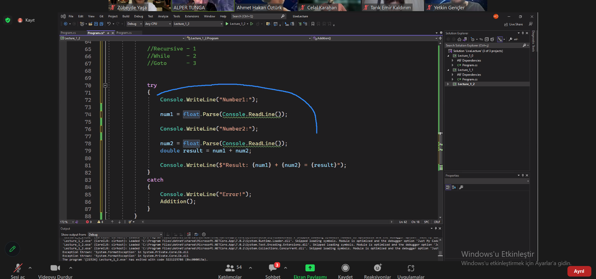
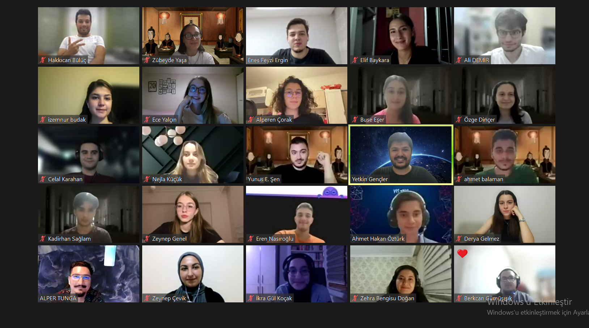
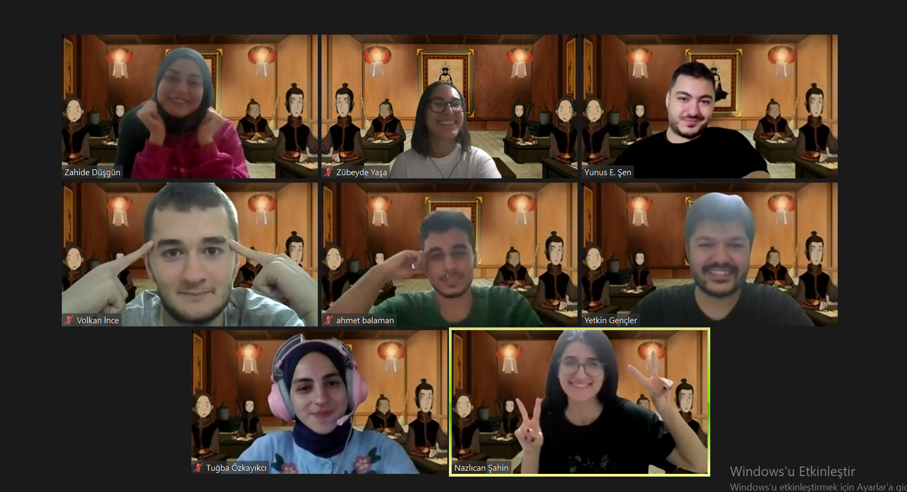

# YetGen Jump & Akbank Backend Eğitim Programı

## Oryantasyon && Code
Bu hafta, var olan koddaki yanlışları düzeltmeye çalıştık, try-catch'i nerede kullanmamız gerektiğini öğrendik. Rastgele gruplarla bize tanımlanan  çözüm önerisi geliştirdik. 
**Projeleri görmek için .cs uzantısını inceleyebilirsiniz.**

# İkinci Hafta -Genel-

-----
# İkinci Hafta -Grup-

